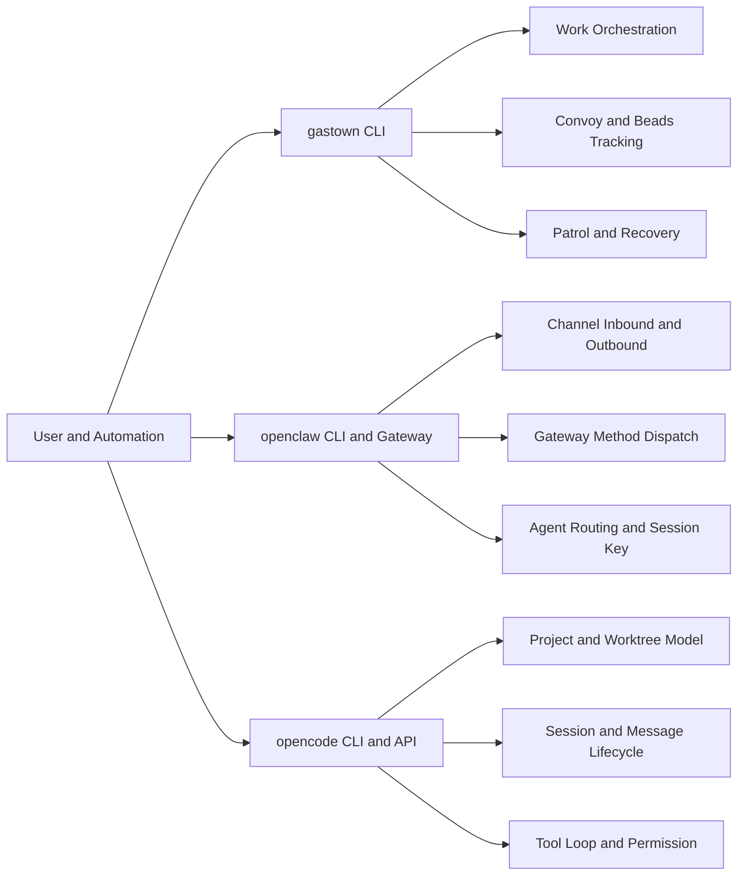

# SpiralOrgan 参考项目业务逻辑总览

## 1. 分析范围

本次分析对象是 `SpiralOrgan/.refer` 下三个项目：

- `gastown`
- `openclaw`
- `opencode`

分析依据来自每个项目的 README、CLI 入口、核心调度模块、会话与持久化模块、消息/路由模块、权限与恢复模块。

## 2. 三项目定位

- `gastown`: 多智能体工程编排器，核心是 `Town/Rig/Crew/Polecat + Beads + Convoy`。
- `openclaw`: 多渠道 AI 网关，核心是 `Gateway 控制平面 + Channel 插件 + Agent 路由`。
- `opencode`: AI 编码代理平台，核心是 `Project/Session/Tool 循环 + HTTP API + CLI/TUI`。

## 3. 业务逻辑总地图    

## 4. 业务域对照矩阵

| 业务域 | gastown | openclaw | opencode |
|---|---|---|---|
| 入口层 | Cobra CLI | Commander CLI + 子 CLI | Yargs CLI |
| 核心对象 | Rig/Crew/Polecat/Convoy | Gateway/Channel/Agent/Node | Project/Session/Tool/Provider |
| 路由逻辑 | issue->rig->polecat | channel+binding->agent+sessionKey | directory->project->session |
| 执行引擎 | tmux + agent runtime | Gateway handler + agent runner | SessionProcessor + LLM stream |
| 持久化 | beads + git + hooks | config/session store + gateway state | sqlite + project/session tables |
| 异常恢复 | daemon/deacon patrol | doctor/status/health + policy | permission gate + retry/compaction |

## 5. 文档索引

- `./gastown-business-logic.md`
- `./openclaw-business-logic.md`
- `./opencode-business-logic.md`
- `./90-cross-project-synthesis.md`
