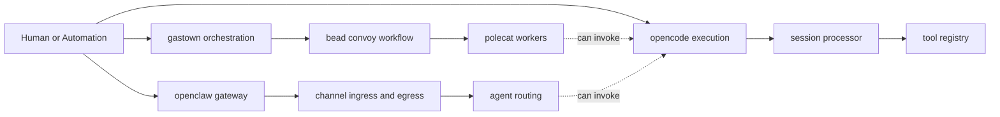
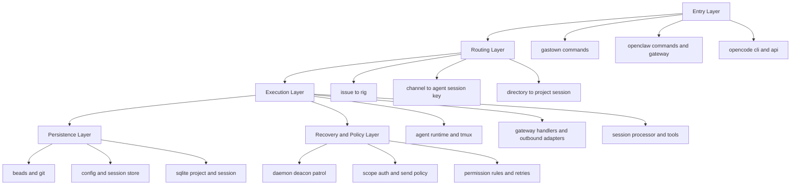

# 三项目业务逻辑综合对照

## 1. 系统角色分工

- `gastown`: 工程流程编排与任务队列治理。
- `openclaw`: 多渠道消息网关与远程控制面。
- `opencode`: 编码执行引擎与会话化 API 平台。

## 2. 端到端能力对照图

## 3. 业务抽象层统一视角

## 4. 可协同模式建议

- 编排优先: 用 `gastown` 作为任务编排入口，`opencode` 作为执行引擎。
- 渠道优先: 用 `openclaw` 作为统一消息入口，把渠道指令路由到 `opencode` 会话执行。
- 运维闭环: 让 `gastown` 的 convoy 和 `openclaw/opencode` 的会话事件汇总到统一观察面。

## 5. 结论

三者并不是同类替代关系，而是可组合关系：

- `gastown` 管“任务编排与落地节奏”。
- `openclaw` 管“消息入口与控制平面”。
- `opencode` 管“会话执行与工具链能力”。
