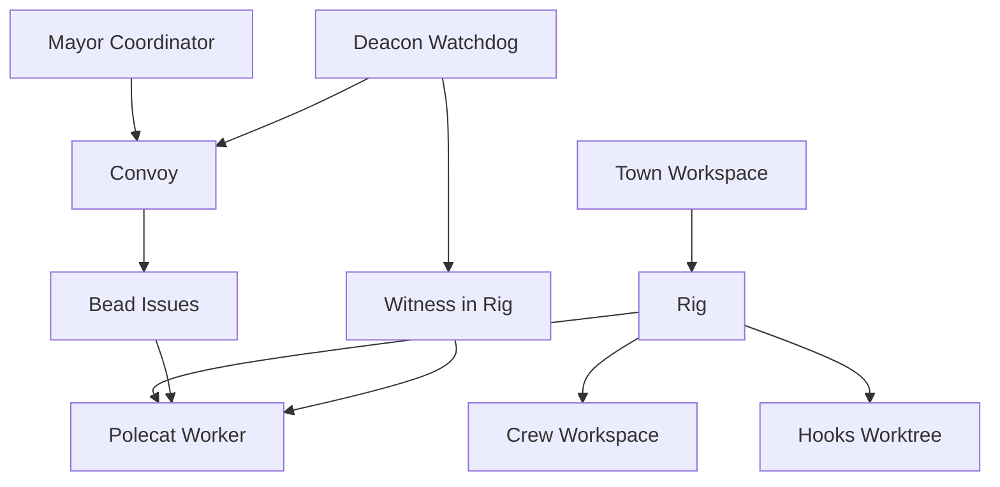
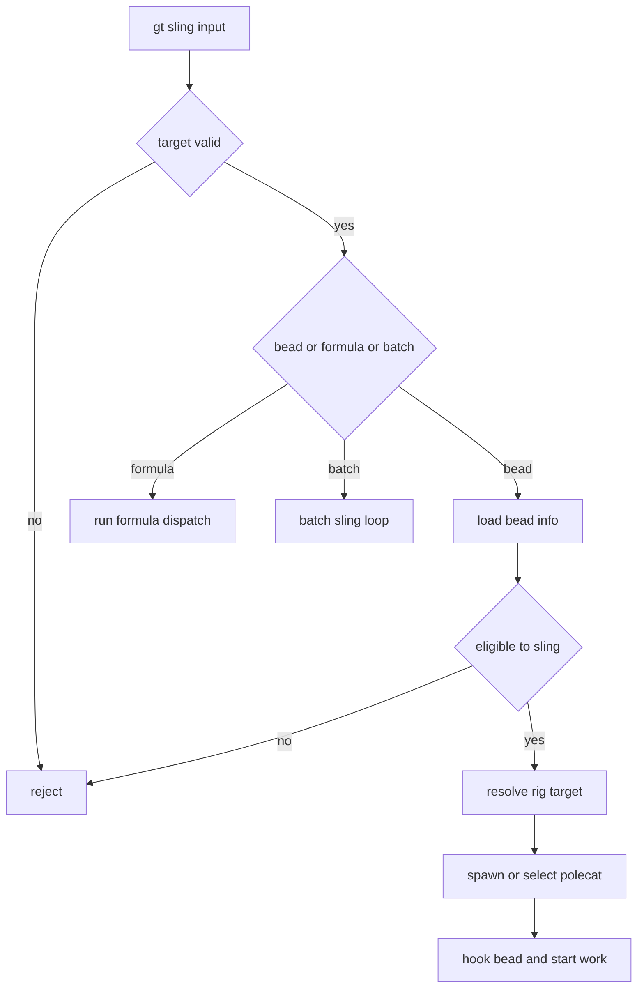
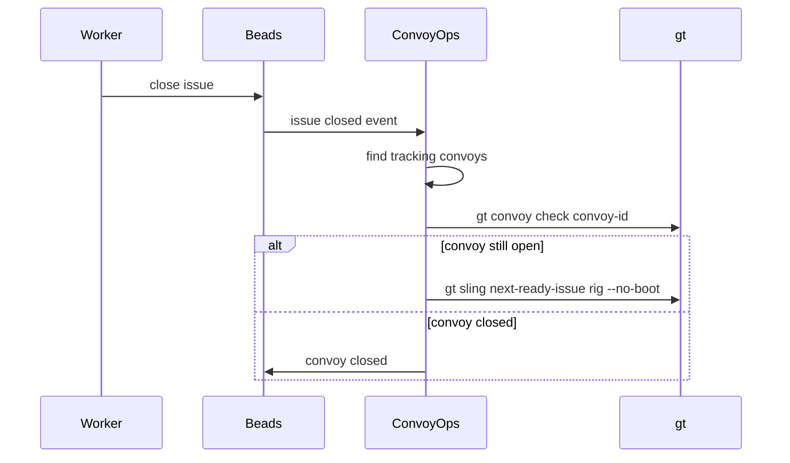
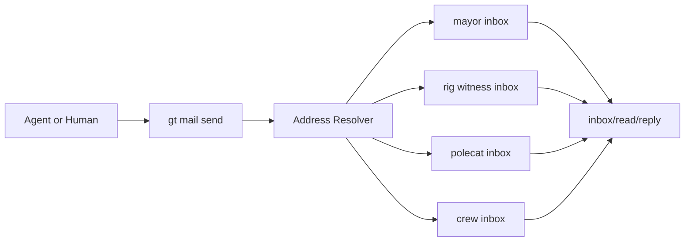
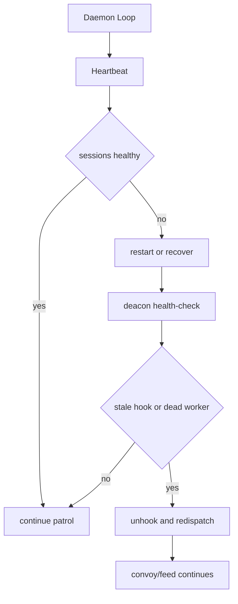

# gastown 业务逻辑拆解

## 1. 核心业务模型

`gastown` 的业务本质是“让多个 agent 在多个代码仓上下文中可持续协作，并把工作状态从会话内存转为可恢复的外部状态”。

关键对象：

- Town: 全局工作区。
- Rig: 项目容器。
- Crew: 人类/主操作者工作区。
- Polecat: 任务 worker。
- Mayor/Deacon/Witness: 协调与巡检角色。
- Bead: 工作项。
- Convoy: 工作批次追踪单元。

## 2. 命令层业务域

从 `internal/cmd` 的命令注册可见，业务域可分为：

- 工作管理: `sling`, `convoy`, `close`, `formula`, `molecule`。
- 代理管理: `mayor`, `deacon`, `crew`, `agents`, `polecat`。
- 通信系统: `mail`, `nudge`, `handoff`, `hook`。
- 运行与服务: `daemon`, `dashboard`, `doctor`, `boot`, `dolt`。
- 配置治理: `config`, `role`, `theme`, `install`。

## 3. 任务分发业务：`sling`

`sling` 是主分发入口，核心业务规则包括：

- 禁止 polecat 自我再分发，避免调度回环。
- 支持单 bead、公式、批量 bead 分发。
- 分发前检查 bead 合法性、状态、是否 deferred、是否 stale hook。
- 支持自动 convoy 创建、merge 策略、并发批量分发。

## 4. Convoy 业务：批次生命周期与自动续推

Convoy 相关业务由 `convoy` 命令和 `internal/convoy/operations.go` 构成：

- `create/add/list/status/check/close/land` 管理 convoy 生命周期。
- 通过 `tracks` 依赖关系把 convoy 与多个 issue 绑定。
- issue 关闭事件触发 `CheckConvoysForIssue`：
  - 检查 convoy 是否可关闭。
  - 若未关闭，自动 feed 下一个 ready issue。

## 5. Mail 业务：跨角色消息总线

`mail` 子系统以 bead message 形式提供统一消息路由：

- 地址模型支持：`mayor/`, `<rig>/witness`, `<rig>/<polecat>`, `<rig>/crew/<name>`。
- 支持 `send/inbox/read/reply/archive/mark-read/search`。
- 支持列表广播、抄送、回复线程、优先级与类型。

## 6. 巡检恢复业务：Daemon + Deacon

Daemon 是后台恢复保障层，Deacon 是巡检 agent：

- Daemon 负责心跳轮询、session 保活、convoy manager、curator 等后台职责。
- Deacon 负责健康检查、stale hook 清理、redispatch、pause/resume、zombie 清理。
- 会话失活后可通过 tmux + auto-respawn + redispatch 进行恢复。

## 7. 状态持久化业务

- 工作项与关系: `beads`（issue, dependency, tracks）。
- 代码状态: `git + worktree + hooks`。
- 会话状态: `tmux session` + registry。
- 巡检状态: daemon state/pid/heartbeat。

## 8. 结论

`gastown` 的业务逻辑是“工程任务编排系统”，重点不在模型能力本身，而在：

- 多 agent 分工与角色边界。
- 工作状态可追踪、可恢复。
- convoy 驱动的批处理推进与闭环落地。
