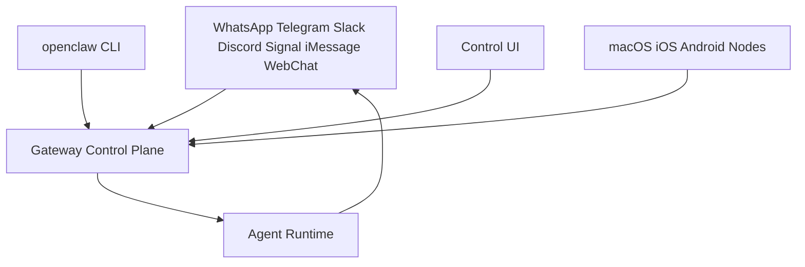
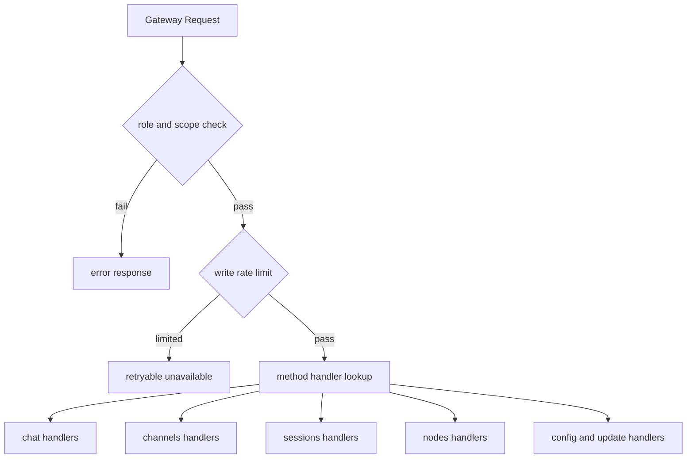
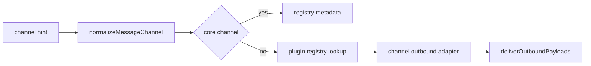
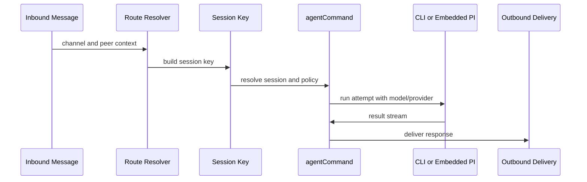

# openclaw 业务逻辑拆解

## 1. 核心业务定位

`openclaw` 是“多渠道 AI 网关控制平面”，把不同消息渠道、设备节点、CLI/Web 客户端统一到 Gateway。

## 2. 命令面业务

命令注册分两层：

- Core CLI: `setup/onboard/configure/message/agent/status/health/sessions/browser`。
- Sub CLI: `gateway/channels/plugins/nodes/devices/sandbox/cron/docs/security/update/...`。

业务含义：

- 安装与初始化（setup/onboard/configure）。
- 运行与观测（status/health/doctor/dashboard/gateway）。
- 渠道与插件管理（channels/plugins/directory/security）。
- 代理与会话（agent/agents/sessions）。

## 3. Gateway 业务：方法分发与权限范围

Gateway 的核心处理在 `server-methods` 聚合：

- 支持 `chat/channels/models/sessions/skills/config/nodes/send/usage/...`。
- 根据连接角色和 scope 做方法级授权。
- 对控制平面写操作做限流。

## 4. 渠道业务：Docking + 插件化

`channels/registry.ts` 定义核心渠道元信息，插件注册运行时渠道实现：

- 核心渠道顺序: `telegram, whatsapp, discord, irc, googlechat, slack, signal, imessage`。
- 支持 alias 归一化。
- 可通过 plugin registry 注入额外渠道及别名。
- 出站发送统一走 outbound adapter。

## 5. Agent 路由与会话业务

关键链路来自 `routing/resolve-route.ts` + `commands/agent.ts`：

- 按 `channel/account/peer/guild/team/roles` 匹配 binding，确定目标 agent。
- 生成 session key（支持 main、peer、thread 语义）。
- `agentCommand` 根据 provider 类型选择 `runCliAgent` 或 `runEmbeddedPiAgent`。
- 交付策略由 send policy 决定 allow/deny。

## 6. 消息动作业务

`message-action` 业务提供统一动作层，覆盖发送与管理操作：

- 基础动作: `send/broadcast/poll/read/reply/edit/delete`。
- 群组管理: `renameGroup/addParticipant/removeParticipant/leaveGroup`。
- 平台能力: `pin/thread/emoji/sticker/role/channel/event/moderation`。

## 7. 安全业务

- 发送策略: `session sendPolicy`，可按 channel/chatType/sessionKey 规则 allow/deny。
- Gateway 方法授权: role + scope。
- 控制平面限流: 防止高频写配置/更新。
- 审批机制: exec approvals + 节点策略。

## 8. 结论

`openclaw` 的业务逻辑核心是“统一控制平面”：

- 多渠道消息 ingress/egress 标准化。
- 路由与会话键体系保证上下文连续。
- 网关方法、权限和限流形成运维级控制闭环。
