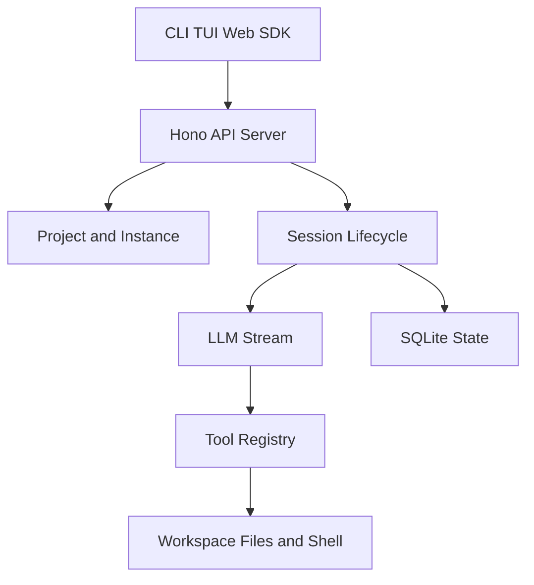
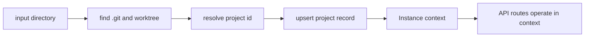
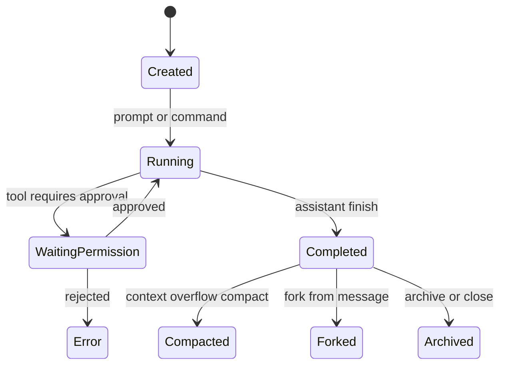
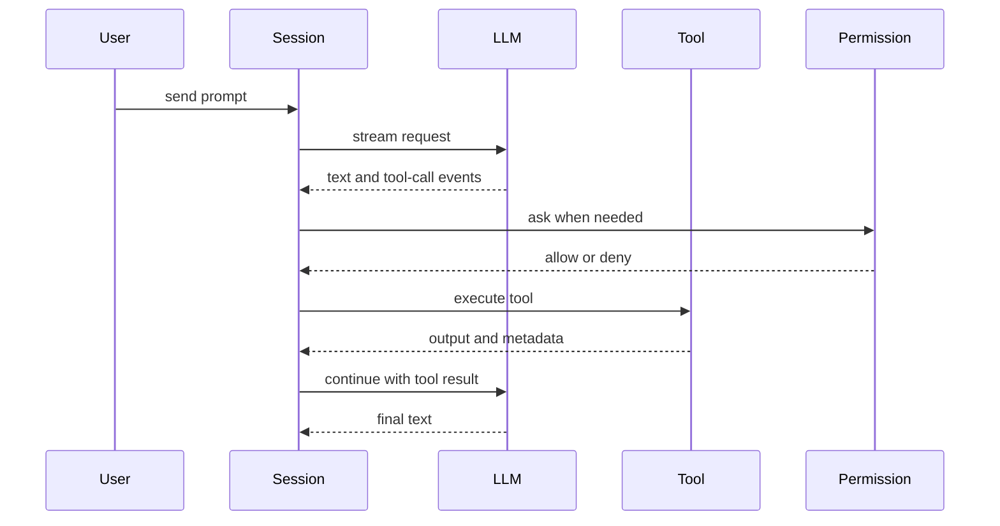
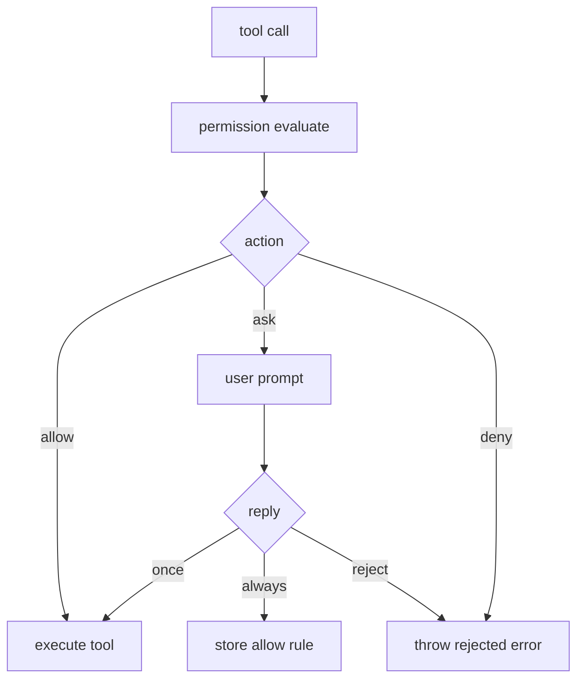

# opencode 业务逻辑拆解

## 1. 核心业务定位

`opencode` 是“AI 编码代理平台”，通过客户端（CLI/TUI/Web）驱动服务端会话、工具调用和项目状态管理。

## 2. CLI 业务

`src/index.ts` 将命令分为若干业务域：

- 会话运行: `run`, `session`, `attach`, `thread`。
- 服务能力: `serve`, `web`, `db`。
- 模型与认证: `models`, `auth`。
- 生态扩展: `mcp`, `agent`, `github`, `pr`。
- 数据流转: `export`, `import`。

`run` 命令核心业务：

- 解析消息、附件、stdin。
- 创建或续接 session（支持 fork）。
- 根据事件流渲染 text/reasoning/tool 输出。
- 可本地内嵌 server 或 attach 远端 server。

## 3. Project/Instance 业务

`Project.fromDirectory` + `Instance.provide` 构成目录到项目实例映射：

- 自动识别 git 根与 worktree。
- 为项目生成稳定 project id。
- 将同目录请求绑定到同一个 instance 上下文。

## 4. Session 生命周期业务

Session API 覆盖：

- 创建、查询、更新、删除、fork。
- init/share/compact/revert/todo/status。
- 消息与分片（message + parts）流式更新。

## 5. LLM 与工具循环业务

`SessionProcessor` 是执行中枢：

- 消费 LLM stream 事件（text/reasoning/tool）。
- 更新 part 状态（pending/running/completed/error）。
- 检测 doom loop（重复同工具同入参）并触发权限询问。
- 计算 usage、生成 patch diff、触发 summary/compaction。

`ToolRegistry` 提供工具组合与模型差异适配：

- 内置工具: bash/read/glob/grep/edit/write/webfetch/task/todo/websearch/codesearch/skill/apply_patch。
- 按模型特性切换 `apply_patch` 与 `edit/write`。
- 挂载自定义 tool 与 plugin tool。

## 6. 扩展业务：MCP + Skill + Plugin

- MCP: 支持 remote/sse/stdio，包含 OAuth、状态管理、工具转换为 AI SDK tool。
- Skill: skill 可注入命令和提示模板。
- Plugin: 可注册额外工具与行为 hook。

## 7. 权限业务

`permission` 与 `permission.next` 提供两套能力：

- Pending 请求与用户回复（once/always/reject）。
- 规则评估（permission+pattern 匹配）。
- 项目级审批记忆与自动放行。

## 8. 结论

`opencode` 的业务逻辑是“以 session 为中心的编码执行平台”：

- 目录与项目模型提供多项目隔离。
- 会话事件流把生成、工具、权限、补丁统一在一条状态链。
- MCP/Skill/Plugin 使其具备长期可扩展的 agent 平台属性。
